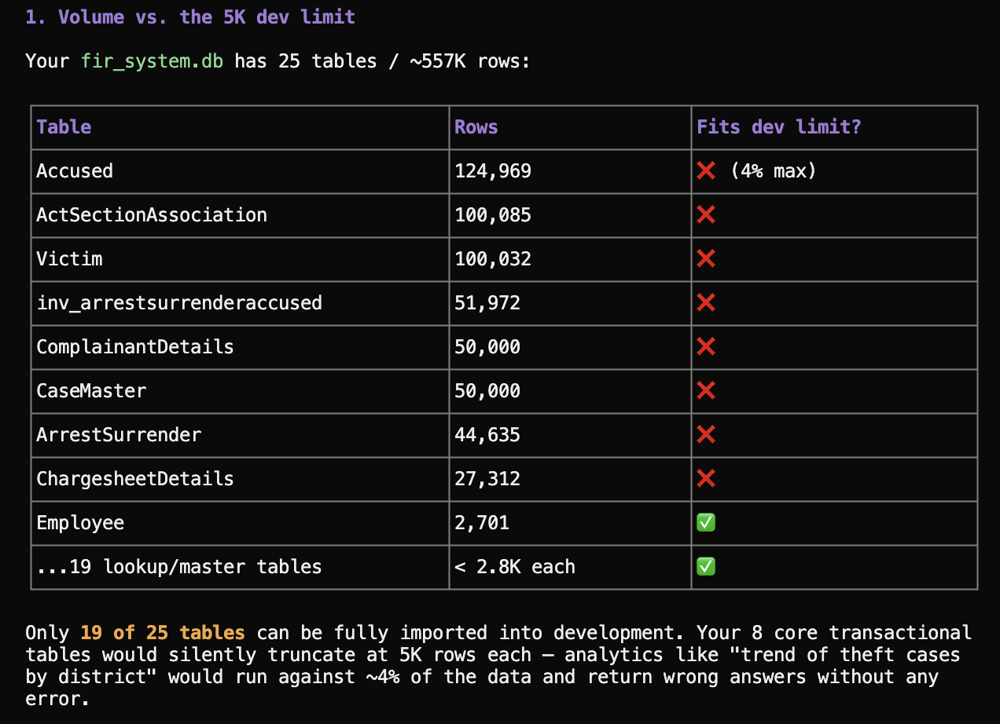
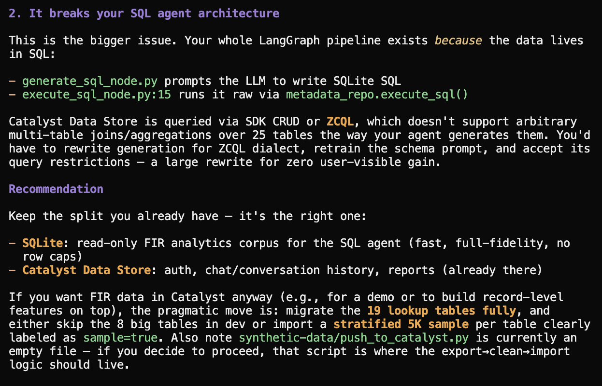

# KSP CrimeLens Intelligence Framework

**A full-stack AI-powered crime intelligence platform for the Karnataka State Police.**

Officers ask questions in natural language — in English or Kannada — and get instant answers backed by SQL analytics, interactive maps, criminal network graphs, and automated case prioritisation. The platform goes beyond simple data retrieval to surface hidden relationships between crimes, offenders, locations, and time patterns, enabling data-driven policing at scale.

---

## Problem

Karnataka's police force manages tens of thousands of FIRs across 31 districts. Analysts currently rely on manual SQL queries or rigid report templates to find patterns, link cases, and allocate patrol resources. Critical intelligence — like repeat offenders operating across jurisdictions, or emerging crime hotspots — is buried in spreadsheets and slow, ad-hoc queries.

**The core gap:** Officers who need answers don't always have the technical skills to extract them, and the tools that exist don't connect crime data, geography, network analysis, and case management into a single, actionable interface.

---

## Solution

KSP CrimeLens Intelligence Framework connects five operational modules through a shared AI backbone:

| Module                     | Purpose                                    | Key Interaction                                                            |
| -------------------------- | ------------------------------------------ | -------------------------------------------------------------------------- |
| **Natural Language Chat**  | Ask any question about the crime database  | Conversational AI with auto-generated charts and SQL                       |
| **Investigations**         | Triage and solve individual cases          | Priority-scored case queue, cross-investigation intel, FIR/PDD export      |
| **Crime Intelligence Map** | Decide where to deploy police resources    | Heatmaps, cluster analysis, district risk, patrol route planner            |
| **Criminal Networks**      | Understand organisations and relationships | Interactive graph visualisation, bridge individual detection, AI summaries |
| **Reports**                | Collect and share findings                 | Drag-to-reorder intelligence workbooks, PDF/Word export                    |

Every module has access to an embedded AI assistant — officers never leave their workflow to ask a follow-up question.

---

## Features

### Natural Language to SQL

Officers type or speak questions in plain English or Kannada. A **13-node LangGraph agent** detects the language, translates if needed, classifies intent, plans the query, generates SQL, executes it, and returns a structured analysis with charts and follow-up suggestions.

### Bilingual (English / Kannada)

Full end-to-end language pipeline: input is detected via Unicode range analysis, translated to canonical English using domain dictionaries (332 lines of crime-specific mappings for districts, crime heads, ranks, acts, and more), processed by the SQL engine in English-only, then translated back to Kannada for the response. Officers can switch languages mid-conversation.

### Crime Intelligence Map

Four map layers powered by deck.gl and MapLibre:

- **Trend Heatmap** — crime density with period-over-period change detection
- **Cluster View** — DBSCAN-based hotspot identification with peak time windows
- **District Risk** — composite risk scores (volume, pending cases, emerging trends)
- **Network Overlay** — criminal group presence mapped to geographic areas

Includes a **patrol route planner** that generates optimised deployment plans by time-of-day, crime focus, and available units.

### Investigation Command Center

Every case gets a priority score (Critical / High / Medium / Low) based on gravity, repeat offender involvement, chargesheet deadlines, and pending arrests. The system surfaces similar cases with shared accused or shared acts, and provides cross-investigation intelligence to prevent duplicate efforts.

### Criminal Network Analysis

Cytoscape-powered interactive graph visualisation of person-to-person connections derived from shared FIRs. Detects:

- **Bridge individuals** — people connecting otherwise separate criminal groups
- **Community structures** — connected components within the network
- **Repeat offender zones** — geographic clusters of recurring suspects

Each person gets a network profile with score, rank, associated FIRs, known associates, and recent activity timeline.

### Reports Dashboard

Saved analyses become draggable widgets on a configurable reports dashboard. Each widget can be expanded, minimised, hidden, or exported. Full SQL and AI reasoning are inspectable per report. Export to PDF or Word for briefings and inter-departmental sharing.

### Role-Based Authentication

KGID-verified identity system: officers sign in with their Karnataka Government ID and date of birth. Sessions are token-based with 4-hour expiry. Account creation requires identity verification against the employee database before credentials are set.

---

## Architecture

```
┌─────────────────────────────────────────────────────────────┐
│                     FRONTEND (React 18)                     │
│  Vite + Tailwind CSS v4 + react-i18next                     │
│  ┌──────────┬──────────────┬───────────┬──────────┬────────┐ │
│  │   Chat   │Investigations│ Crime Map │ Networks │Reports │ │
│  └────┬─────┴──────┬───────┴─────┬─────┴────┬─────┴───┬────┘ │
│       └────────────┼─────────────┼──────────┼─────────┘      │
│                    ▼             ▼          ▼                 │
│              REST API (6 routers)                             │
└────────────────────────────┬────────────────────────────────┘
                             │
┌────────────────────────────▼────────────────────────────────┐
│                  BACKEND (FastAPI)                           │
│  Deployed as Zoho Catalyst Advanced I/O Function             │
│                                                              │
│  ┌─────────────────────────────────────────────────────┐     │
│  │            LangGraph SQL Agent (13 nodes)           │     │
│  │                                                     │     │
│  │  language_detection → translate_query → router       │     │
│  │       │                              /         \    │     │
│  │       │                           chat       planner│     │
│  │       │                              \         /    │     │
│  │       │                           finalize          │     │
│  │       │                              │              │     │
│  │       └──────────────────── translate_response      │     │
│  │                                                     │     │
│  │  SQL path: planner → fetch_values → generate_sql    │     │
│  │            → execute_sql → response + chart         │     │
│  └─────────────────────────────────────────────────────┘     │
│                                                              │
│  ┌──────────┐  ┌──────────────────┐  ┌──────────────────┐   │
│  │ Auth     │  │ Investigations   │  │ Crime Map        │   │
│  │ Routes   │  │ Routes           │  │ Routes           │   │
│  └──────────┘  └──────────────────┘  └──────────────────┘   │
│  ┌──────────┐  ┌──────────────────┐  ┌──────────────────┐   │
│  │ Chat     │  │ Reports          │  │ Network          │   │
│  │ Routes   │  │ Routes           │  │ Routes           │   │
│  └──────────┘  └──────────────────┘  └──────────────────┘   │
└────────────────────────────┬────────────────────────────────┘
                             │
            ┌────────────────┼────────────────┐
            ▼                ▼                ▼
   ┌──────────────┐ ┌──────────────┐ ┌──────────────────┐
   │   SQLite     │ │   Catalyst   │ │   Catalyst       │
   │   (FIR Data) │ │   NoSQL      │ │   Datastore      │
   │              │ │   (Chat &    │ │   (User Auth &   │
   │  50K cases   │ │  Conversations│ │   Reports)       │
   │  22 tables   │ │              │ │                  │
   └──────────────┘ └──────────────┘ └──────────────────┘
```

---

## Tech Stack

| Layer          | Technology                                                                                                        |
| -------------- | ----------------------------------------------------------------------------------------------------------------- |
| **Frontend**   | React 18, Vite, Tailwind CSS v4, react-router-dom v7                                                              |
| **Charts**     | Recharts                                                                                                          |
| **Maps**       | deck.gl 9.x, MapLibre GL, react-map-gl, Turf.js                                                                   |
| **Graphs**     | Cytoscape.js                                                                                                      |
| **i18n**       | react-i18next (English + Kannada)                                                                                 |
| **Backend**    | Python 3.13, FastAPI, LangGraph, LangChain                                                                        |
| **LLM**        | Zoho Catalyst QuickML (GLM-47B), with Groq and Ollama fallbacks                                                   |
| **Auth**       | passlib (pbkdf2_sha256 + bcrypt), itsdangerous (JWT-like tokens)                                                  |
| **Database**   | SQLite (read-only FIR data), Zoho Catalyst NoSQL (chat persistence), Zoho Catalyst Datastore (user auth, reports) |
| **Export**     | Playwright (PDF rendering), python-docx (Word), jsPDF + SheetJS (client-side PDF/Excel)                           |
| **Deployment** | Zoho Catalyst (Advanced I/O Function + Slate App)                                                                 |

---

## Project Structure

```
datathon-ksp-app/
├── datathon-ksp-client/          # React frontend
│   ├── src/
│   │   ├── pages/                # Home, Login, Signup, Investigations,
│   │   │                         # CrimeIntelligenceMap, Networks, Reports
│   │   ├── components/           # DashboardLayout, ChatPanel, MapLayers,
│   │   │                         # NetworkGraph, ReportWidget, etc.
│   │   ├── auth/                 # AuthContext, ProtectedRoute
│   │   ├── locales/en/           # English translations (344 keys)
│   │   └── locales/kn/           # Kannada translations
│   └── vite.config.js            # Dev proxy to Catalyst gateway
│
├── functions/datathon-ksp-app/   # FastAPI backend
│   ├── main.py                   # App entry, Catalyst WSGI handler
│   ├── agents/sql_query_db/      # LangGraph SQL Agent
│   │   ├── graph.py              # StateGraph definition
│   │   ├── state.py              # SQLAgentState TypedDict
│   │   ├── nodes/                # 13 agent nodes
│   │   └── functions/            # LLM prompts, SQL utilities
│   ├── routes/                   # auth, chat, investigations,
│   │                             # reports, crime_map, network
│   ├── db/                       # SQLite + Catalyst repositories
│   ├── auth/                     # Password hashing, token management
│   ├── llm/                      # LLM abstractions (Catalyst, Groq, Ollama)
│   ├── schemas/                  # Pydantic request/response models
│   ├── config/domain_dictionary.py  # Kannada↔English crime terminology
│   └── services/                 # PDF, Word, report generation
│
├── synthetic-data/               # Data generation pipeline
│   ├── generate_fir_data.py      # Faker-based 50K case generator
│   ├── csv_to_sqlite.py          # CSV → SQLite loader (22 tables, 24 indexes)
│   └── fir_system.db             # SQLite database (lives in backend bundle)
│
└── perf-testing/                 # Performance testing suite
    ├── locustfile.py             # 33-endpoint load test (4 user types)
    ├── benchmark_sqlite.py       # 27-query SQLite benchmark with SLO checks
    ├── run_perf_test.sh          # Scenario runner with pass/fail exit codes
    ├── generate_report.py        # Custom HTML report generator
    └── requirements.txt          # perf-testing dependencies
```

---

## Setup

### Prerequisites

- Node.js 18+
- Python 3.13+
- [Zoho Catalyst CLI](https://www.zoho.com/catalyst/help/apis-and-sdks/cli.html) (for full-stack development)

### Quick Start

```bash
# Clone the repository
git clone <repo-url> && cd datathon-ksp-app

# Generate synthetic crime data
pip install faker
cd synthetic-data
python3 generate_fir_data.py
python3 csv_to_sqlite.py
cd ..

# Start the full stack via Catalyst Gateway
catalyst serve
```

- **Frontend**: http://localhost:3000/app/
- **Backend API**: http://localhost:3000/server/datathon-ksp-app/

### Frontend Only (Development)

```bash
cd datathon-ksp-client
npm install
npm run dev          # Runs on http://localhost:5173 (proxies /api to port 3000)
```

### Backend Only (Standalone)

```bash
cd functions/datathon-ksp-app
pip install -r requirements.txt
python main.py       # Runs on http://localhost:8000
```

> **Note**: Standalone mode supports SQLite endpoints. Catalyst SDK routes (auth, chat persistence, reports) require the Catalyst execution context.

### Environment Variables

Set in `functions/datathon-ksp-app/.env`:

| Variable               | Description                                                                       |
| ---------------------- | --------------------------------------------------------------------------------- |
| `SQLITE_DATABASE_PATH` | Path to `fir_system.db` (defaults to backend bundle; override with absolute path) |
| `GROQ_API_KEY`         | Groq LLM API key (fallback provider)                                              |
| `SECRET_KEY`           | Token signing key for authentication                                              |

---

## Synthetic Data

The data pipeline generates **50,000 FIR cases** across **22 relational tables** with full referential integrity:

- **31 districts** across Karnataka
- **5 crime heads** (Crimes Against Body, Property, Women, Public Order, Economic Offences)
- **21 sub-heads** with realistic distributions
- **~100,000 accused** and victims with demographic attributes
- **Temporal span**: 2022–2026 with seasonal crime patterns
- **24 database indexes** for query performance

```bash
cd synthetic-data
python3 generate_fir_data.py    # Generates CSVs with Faker
python3 csv_to_sqlite.py        # Loads into functions/datathon-ksp-app/fir_system.db
```

---

## How the SQL Agent Works

The LangGraph agent is a 13-node state machine that processes every user query:

1. **Language Detection** — Unicode range analysis; ≥30% Kannada characters triggers Kannada mode
2. **Query Translation** — LLM translates Kannada to English using domain dictionaries
3. **Intent Routing** — LLM classifies as `"sql"` (data question) or `"chat"` (general conversation)
4. **Schema Planning** — Selects relevant tables and identifies columns needing value lookup
5. **Value Resolution** — `SELECT DISTINCT` queries to populate accurate `WHERE` clause values
6. **SQL Generation** — LLM generates SQLite query with schema hints and analytical patterns
7. **Execution** — Query runs against the FIR database
8. **Response + Chart** — Parallel nodes: structured analysis (markdown + follow-up questions) and chart metadata
9. **Finalization** — Merges outputs into a unified response
10. **Response Translation** — Translates English output back to Kannada if needed

The agent uses **Catalyst QuickML** (GLM-47B) for all LLM calls, with Groq and Ollama available as fallback providers.

---

## Multilingual Support

### Domain Dictionary

`config/domain_dictionary.py` maps **332 Kannada terms** to canonical English equivalents:

- **Crime Heads**: 5 primary categories
- **Sub-Heads**: 21 specific offence types
- **Districts**: 31 districts with alternate name aliases
- **Case Attributes**: statuses, gravity levels, ranks, acts, unit types
- **Query Terms**: common investigation vocabulary

### Language Pipeline

```
User Input (Kannada)
    ↓
Unicode Detection → "kn"
    ↓
LLM Translation → English (canonical)
    ↓
SQL Agent (English-only database)
    ↓
English Response
    ↓
LLM Translation → Kannada
    ↓
User Output (Kannada)
```

The database stays English-only. Only input and output are translated — ensuring SQL accuracy regardless of query language.

---

## API Endpoints

| Method | Endpoint                   | Description                                         |
| ------ | -------------------------- | --------------------------------------------------- |
| `POST` | `/chat/generate`           | Send a message, get AI response with SQL and charts |
| `POST` | `/auth/signup`             | Create account (KGID verification required)         |
| `POST` | `/auth/signin`             | Authenticate with KGID + password                   |
| `GET`  | `/investigations/summary`  | Dashboard stats and priority queue                  |
| `POST` | `/investigations/filtered` | Filtered investigation list                         |
| `GET`  | `/investigations/{id}`     | Case detail with intelligence panel                 |
| `GET`  | `/crime-map/summary`       | Operational summary for map view                    |
| `POST` | `/crime-map/heatmap`       | Heatmap data with trend analysis                    |
| `POST` | `/crime-map/clusters`      | DBSCAN cluster intelligence                         |
| `POST` | `/crime-map/patrol-plan`   | Generate patrol deployment routes                   |
| `GET`  | `/networks/search`         | Search people, FIRs, stations                       |
| `GET`  | `/networks/person/{id}`    | Person profile with network graph                   |
| `POST` | `/reports/save`            | Save a report widget                                |
| `GET`  | `/reports/list`            | List saved reports                                  |

---

## Performance Testing

The project includes a two-layer performance testing suite in `perf-testing/`:

### HTTP Load Testing (Locust)

Simulates concurrent users hitting the live API with realistic traffic patterns. Covers **33 endpoints** across all four backend modules:

| User Type          | Weight | Endpoints                                                                                   | What It Tests                                                          |
| ------------------ | ------ | ------------------------------------------------------------------------------------------- | ---------------------------------------------------------------------- |
| **Health**         | 1      | `/health`                                                                                   | Unauthenticated baseline throughput                                    |
| **Investigations** | 3      | 6 endpoints (list, summary, filters, detail, intel, similar)                                | Paginated queries, case joins, cross-investigation intelligence        |
| **Crime Map**      | 3      | 18 endpoints (heatmap, clusters, districts, patrol, network overlay, etc.)                  | Geospatial aggregation, DBSCAN clustering, patrol route generation     |
| **Network**        | 2      | 9 endpoints (search, profile, graph, associates, timeline, analytics, communities, bridges) | Person graph traversal, community detection, bridge individual scoring |

Each response is validated for correct status codes and JSON envelope structure. Failed requests are tracked and reported.

**Scenarios:**

```bash
# Quick smoke test — validates all endpoints respond
bash perf-testing/run_perf_test.sh --scenario smoke

# Steady-state baseline — 20 users for 60s
bash perf-testing/run_perf_test.sh --scenario baseline

# Spike test — ramps to 100 users, holds, drops back
bash perf-testing/run_perf_test.sh --scenario spike

# Soak test — 30 users for 5 minutes
bash perf-testing/run_perf_test.sh --scenario soak
```

### SQLite Query Benchmark

Profiles **27 SQL queries** directly against the FIR database, measuring latency independent of the HTTP layer. Queries are categorized by complexity with P95 SLO thresholds:

| Category          | SLO (P95) | Queries Tested                                                                              |
| ----------------- | --------- | ------------------------------------------------------------------------------------------- |
| Simple Selects    | 50ms      | Employee lookup, district list, crime heads, unit filter                                    |
| Aggregations      | 100ms     | Case counts, monthly trends, chargesheet pending, repeat offenders                          |
| Join-Heavy        | 200ms     | Investigation list, case detail, similar cases, person search, profile, graph               |
| Complex Analytics | 300ms     | Heatmap, district summary, cluster detection, repeat offender zones, patrol recommendations |
| Full Table Scans  | 500ms     | Top 100 offenders, cross-table district × crime × gravity aggregation                       |

```bash
# Run SQLite benchmark (100 iterations per query)
python3 perf-testing/benchmark_sqlite.py --iterations 100

# Export results to JSON for CI
python3 perf-testing/benchmark_sqlite.py --output results.json
```

### Output

Both tools generate structured reports:

- **`report.html`** — Self-contained HTML with summary cards, RPS sparkline, and per-endpoint breakdown (avg, median, P90/P95/P99, failure %)
- **`locust_report.html`** — Standard Locust HTML report
- **`stats_stats.csv`** / **`stats_stats_history.csv`** — Raw CSV for custom analysis
- **`sqlite_benchmark.json`** — Per-query timing statistics with SLO pass/fail flags

The runner script exits with code 1 if any SLO threshold is breached, making it CI-friendly.

---

## Deployment

The platform is deployed on **Zoho Catalyst**:

- **Frontend**: Catalyst Slate App (React SPA)
- **Backend**: Catalyst Advanced I/O Function (FastAPI via `a2wsgi` WSGI adapter)
- **Data**: Catalyst Datastore (relational) + Catalyst NoSQL (chat/conversation persistence)
- **LLM**: Catalyst QuickML API (GLM-47B model)

The `handler(request)` function in `main.py` adapts FastAPI's ASGI interface to Catalyst's WSGI execution model using `a2wsgi.ASGIMiddleware` and `FlaskResponse`.

---

## License

This project was built for the **KSP Datathon** competition.



